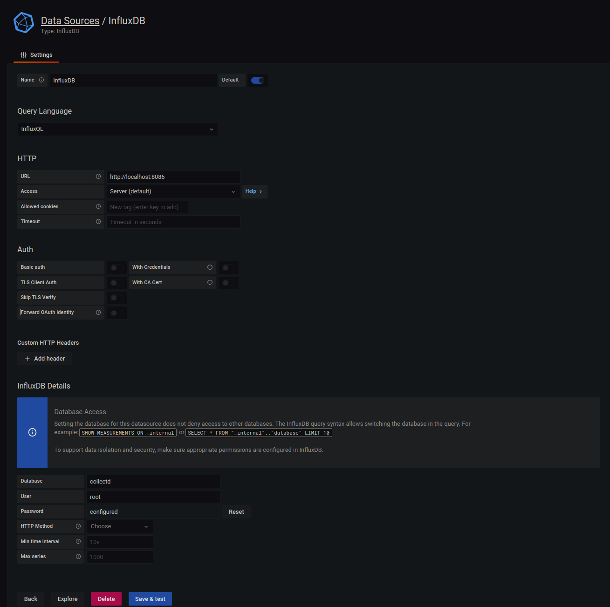
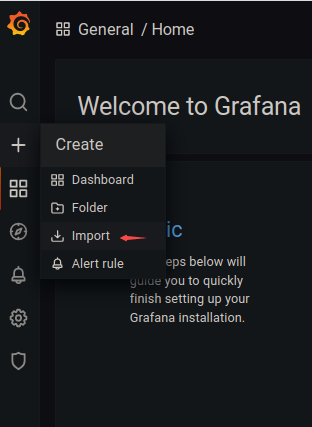
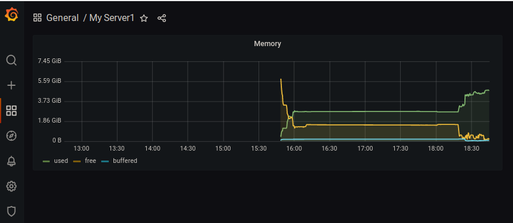

[toc]

## collectd安装
```
sudo apt install collectd
```
### collectd配置
```
➜  ~ sudo vi /etc/collectd/collectd.conf
LoadPlugin network
<Plugin network>
	Server "127.0.0.1" "25826"
</Plugin>

```
修改后文件：
### collectd启动
```
➜  ~ sudo systemctl start collectd.service
➜  ~ sudo systemctl status collectd.service
● collectd.service - Statistics collection and monitoring daemon
     Loaded: loaded (/lib/systemd/system/collectd.service; enabled; vendor preset: enabled)
     Active: active (running) since Thu 2022-06-09 16:19:15 CST; 13min ago
       Docs: man:collectd(1)
             man:collectd.conf(5)
             https://collectd.org
   Main PID: 583565 (collectd)
      Tasks: 12 (limit: 38060)
     Memory: 86.1M
     CGroup: /system.slice/collectd.service
             └─583565 /usr/sbin/collectd

```

## influxdb安装
```
sudo apt install influxdb
```

### influxdb修改配置
```
➜  ~ sudo vi /etc/influxdb/influxdb.conf
[[collectd]]
enabled = true
bind-address = "127.0.0.1:25826"
database = "collectd"
typesdb = "/usr/share/collectd/types.db"
batch-size = 5000
batch-pending = 10
batch-timeout = "10s"
read-buffer = 0
```
修改后文件

### influxdb启动
```
➜  ~ sudo systemctl start influxdb.service
➜  ~ sudo systemctl status influxdb.service
● influxdb.service - InfluxDB is an open-source, distributed, time series database
     Loaded: loaded (/lib/systemd/system/influxdb.service; enabled; vendor preset: enabled)
     Active: active (running) since Thu 2022-06-09 16:58:08 CST; 3s ago
       Docs: man:influxd(1)
   Main PID: 596037 (influxd)
      Tasks: 14 (limit: 38060)
     Memory: 4.4M
     CGroup: /system.slice/influxdb.service
             └─596037 /usr/bin/influxd -config /etc/influxdb/influxdb.conf

```

### influxdb数据库查看

```
~ sudo apt install influxdb-client
~ influx
Connected to http://localhost:8086 version 1.6.4
InfluxDB shell version: 1.6.4


> show databases
name: databases
name
----
_internal
collectd


> use collectd
Using database collectd


> show measurements
name: measurements
name
----
battery_value
cpu_value
df_value
disk_io_time
disk_read
disk_value
disk_weighted_io_time
disk_write
entropy_value
interface_rx
interface_tx
irq_value
load_longterm
load_midterm
load_shortterm
memory_value
processes_value
swap_value
users_value


> select * from memory_value
name: memory_value
time                host      type   type_instance value
----                ----      ----   ------------- -----
1654760916617676406 localhost memory buffered      115879936
1654760916617676406 localhost memory cached        1014091776
1654760916617676406 localhost memory free          6162386944
1654760916617676406 localhost memory slab_recl     88899584
1654760916617676406 localhost memory slab_unrecl   169013248
1654760916617676406 localhost memory used          557109248
1654760926617668774 localhost memory buffered      116088832
1654760926617668774 localhost memory cached        1024028672
......

```

## grafana安装
```
sudo snap install grafana
```
### 修改数据库配置
参考下图


### 导入datasource配置
参考下图，导入文件

### 效果
效果展示如下

## reference
[collectd-influxdb-grafana-docker](https://github.com/justlaputa/collectd-influxdb-grafana-docker)
[try-influxdb-and-grafana-by-docker-6b4d50c6a446#.7z7oz5st5](https://blog.laputa.io/try-influxdb-and-grafana-by-docker-6b4d50c6a446#.7z7oz5st5)
[system-monitoring-with-grafana-influxdb-et-collectd-7827969e1fe)](https://medium.com/@cristianpb/system-monitoring-with-grafana-influxdb-et-collectd-7827969e1fe)