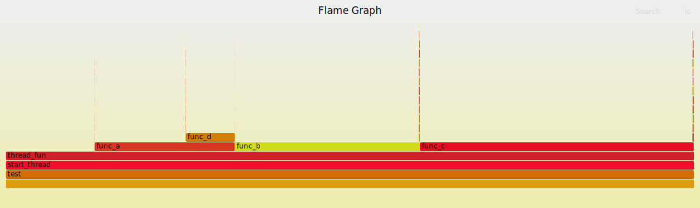

系统性能分析之使用perf生成火焰图
[toc]

## 测试代码
test.c源码如下
```
/* one example to demo flamegraph*/
#include <pthread.h>
void func_d()
{
    int i;
    for (i = 0; i < 50000; i++);
}

void func_a()
{
    int i;
    for (i = 0; i < 100000; i++);
    func_d();
}

void func_b()
{
    int i;
    for (i = 0; i < 200000; i++);
}

void func_c()
{
    int i;
    for (i = 0; i < 300000; i++);
}

void* thread_fun(void* param) 
{
    while (1)
    {
        int i;
        for (i = 0; i < 100000;i++);
        func_a();
        func_b();
        func_c();
    }
}

int main(void) 
{
    pthread_t tid1, tid2;
    int ret;

    ret = pthread_create(&tid1, NULL, thread_fun, NULL);
    if(ret==-1){
    }
    
    ret=pthread_create(&tid2,NULL,thread_fun,NULL);
    
    if(pthread_join(tid1,NULL)!=0){
    }
    if(pthread_join(tid2,NULL)!=0){
    }
    return 0;
}

```
## 编译与执行
```
$ gcc test.c -o test -lpthread
$ ./test &
```

## perf采集
```
$ sudo perf record -F 499 -p $(pidof ./test) -o test.data -ag -- sleep 10
$ sudo perf script -i test.data &> test.unfold
```


## 生成火焰图

```
$ git clone http://github.com/brendangregg/FlameGraph
$ ./FlameGraph/stackcollapse-perf.pl test.unfold > test.folded
$ ./FlameGraph/flamegraph.pl test.folded > test.svg
```
火焰图如下


## reference
[利用perf剖析Linux应用程序](https://blog.gmem.cc/perf)